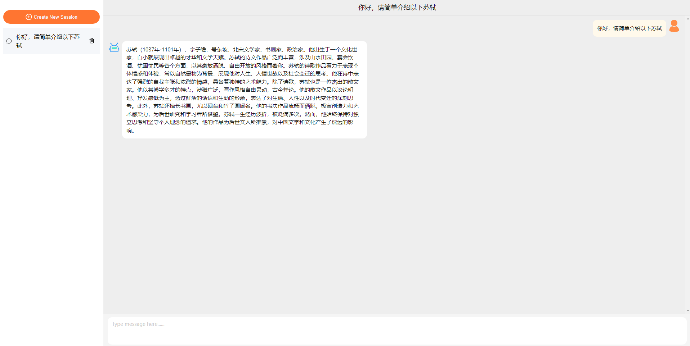

# GPT-chatui-demo

## 介绍
GPT-chatui-demo 是一个基于React和Flask的类似于chatGPT的机器人聊天应用程序。它使用了阿里巴巴开源的chatui（@chatui/core）组件库作为聊天组件，非常轻量级，
开发人员不需要在开发聊天组件时浪费太多精力。它实现SSE流，并提供实时聊天体验。

## 在线体验
http://gpt-chatui-demo.sqlzhushou.com

## 特点
- 😃 轻量级-直接使用chatui组件库，无需在聊天组件的设计和开发方面付出太多精力。
- 😃 现代UI——建立在阿里巴巴成熟的chatui组件库之上。
- 💬 实时聊天-使用服务器发送事件（SSE）以获得流畅的实时聊天体验
- 🎉 离线状态保存-使用IndexedDB在离线时保留聊天记录

## 运行环境
- nodejs>=16
- python3

## 启动方法
```bash
$ git clone https://github.com/youqiang95/GPT-chatui-demo
$ sh install-deps.sh  
$ sh build.sh
$ sh run.sh
```
然后在浏览器中打开这个地址： http://localhost:9000 Experience it now

## 截图



## 技术栈
### 前端
- typescript
- create-react-app
- zustand

### 后端
- python3
- Flask

感谢!
