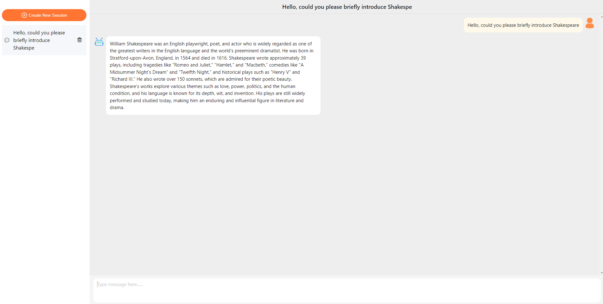

# GPT-chatui-demo

## Introduction
GPT-chatui-demo is a chatGPT like robot chat application based on React and Flask. It uses Alibaba's open-source chatui (@ chatui/core) component library as the chat component, which is very lightweight,
Developers don't need to waste too much energy developing chat components. It implements SSE streaming and provides a real-time chat experience.

## Online experience
http://gpt-chatui-demo.sqlzhushou.com

## features
- 😃 Lightweight - Directly using the chatui component library, without requiring too much effort in the design and development of chat components.
- 😃 Modern UI - Building on Alibaba's mature chatui component library
- 💬 Real time chat - Use server to send events (SSE) for a smooth real-time chat experience
- 🎉 Offline state saving - using IndexedDB to persist chat records while offline

## Operating environment
- nodejs>=16
- python3

## Program startup method
```bash
$ git clone https://github.com/youqiang95/GPT-chatui-demo
$ sh install-deps.sh  
$ sh build.sh
$ sh run.sh
```
Then open it http://localhost:9000 Experience it now

## Screenshot



## Technology Stack
### Front end
- typescript
- create-react-app
- zustand

### back end
- python3
- Flask

Thanks!
